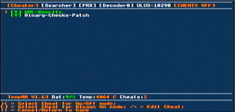

# (real hardware)

## Requirements
- A **PS Vita** with **Custom Firmware** (e.g. HENkaku / ENSO / h-encore² / VitaDeploy / etc..)
- **Adrenaline** installed (eCFW PSP which simulates the PSP environment to launch the game with the cheat plugin TempAR that is necessary)
- A memory stick with at least 1 GB free
- A legally dumped copy of MPO / MPO+ in ISO or CSO format to launch with **Adrenaline**

---

## Installation Steps
1. Connect your PS Vita to your computer via **USB** mode or **FTP** mode (Filezilla of example).
2. Download preconfigured **TempAR** plugin (only TempAR is supported) there : [TempAR Plugin (Cheat Engine for PSP)](https://github.com/snakeswiss/Tutorial-setting-up-MPO-MPO-Online/raw/main/assets/tempar_163.7z)
3. Extract and copy the "seplugins" and past the file in **ux0:/pspemu/**
4. Launch **Adrenaline**
5. On the emulated XMB (main PSP menu), go to **Game > Memory Stick** and launch the game.
6. Once you are in the game main menu hit the **HOME + R** or **DOWN+TRIANGLE** (depending the version of TempAR) button of your PS Vita to show the **TempAR** menu see the screen shot below.

8. Now on this **TempAR** menu hit the **L** button of your PS Vita, it should now say in top right of the screen **[CHEATS ON]** now you can quite the **TempAR** menu hitting circle button
8. Once you loaded your save game go to Infrastructure (or Infrastructure+) and you should be good to connect !
9. If you have any issues past this point, you can ask for support on our Discord join us : [SaveMGO Discord](https://discord.gg/mgo2pc)
