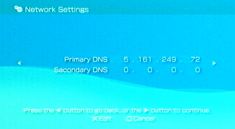

# (real hardware)

## Requirements
- A PSP with custom firmware (e.g. PRO-C2, ME, or Infinity) (PSP Street E-1000 isn't supported as it doens't have a wireless card)
- A memory stick with at least 1 GB free
- A legally dumped copy of MPO / MPO+ in ISO or CSO format or original UMD

---

## Installation Steps
1. Connect your PSP to your computer via USB mode. (or the memory card on an USB reader)
2. On the memory stick, create a folder named `ISO` (if it doesn't exist).
3. Copy your `MPO.iso` or `MPO+.iso` file into the `ISO` folder.
4. Download TempAR plugin (only TempAR is supported) there : [TempAR Plugin (Cheat Engine for PSP)](https://github.com/snakeswiss/Tutorial-setting-up-MPO-MPO-Online/raw/main/assets/tempar_163.7z)
5. Extract and copy the "seplugins" folder and past it in the root of your PSP (overwrite if necessary) 
6. Disconnect the PSP safely.
7. On the XMB, go to "Network Settings" -> “Infrastructure Mode” -> “New Connection” -> “Scan” -> Select your SSID (your network connection name) -> “Address Settings” choose “Custom” -> “IP Address Setting” select “Automatic” -> “DNS Settings” select “Manual” and enter the **Primary DNS Address** set up this IP : **5.161.249.72** -> “Proxy Server” choose “Do Not Use” -> “Internet Browser” select “Do Not Start” -> Then validate and you Network Settings should be ready

8. On the XMB (main PSP menu), go to **Game > Memory Stick** and launch the game.
9. Once you are in the game main menu hit the **♪** button of your PSP to enabled the cheats (TempAR)
10. Once you loaded your save game go to Infrastructure (or Infrastructure+) and you should be good to connect !
11. If you have any issues past this point, you can ask for support on our Discord join us : [SaveMGO Discord](https://discord.gg/mgo2pc)

---

## Recommended Settings
To improve compatibility and loading times:

1. Reboot PSP into **Recovery Menu**:
   - Hold `R` while powering on the console.
2. Go to:
   - `Configuration > UMD Mode`
   - Set to `Sony NP9660 - NO UMD`
3. Disable plugins you don’t need except for "TempAR [GAMES]" (optional).
